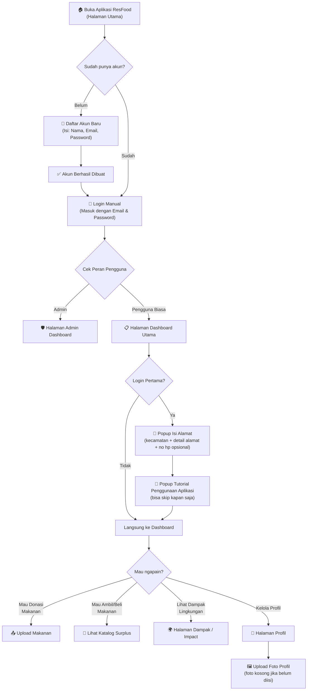
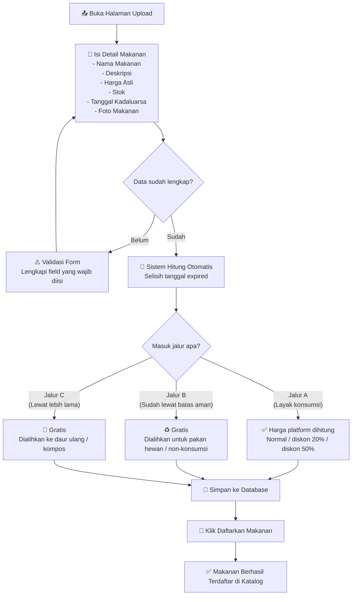
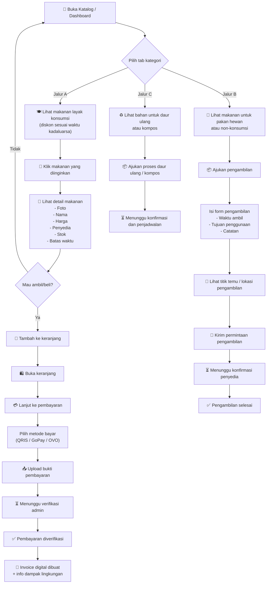
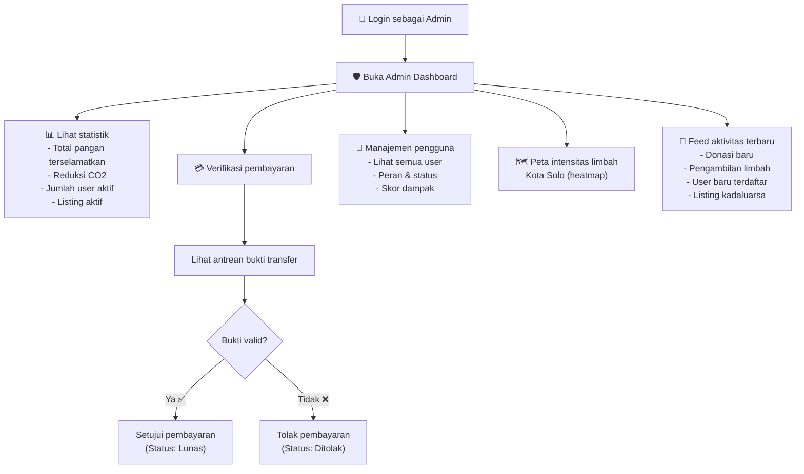
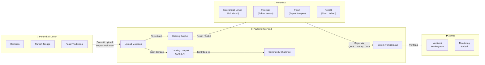

# 🌿 Flowchart Aplikasi ResFood Solo

> **ResFood** adalah platform pengelolaan surplus pangan (makanan berlebih) di Kota Solo. Tujuannya adalah mengurangi limbah makanan, mempercepat distribusi pangan layak konsumsi, dan mendukung ekonomi sirkular.

---

## 1. Alur Utama Pengguna

Flowchart ini menjelaskan alur nyata pengguna di aplikasi ResFood dari registrasi sampai penggunaan fitur utama.

---

## 2. Alur Donor / Penyedia Makanan

Ini adalah alur untuk orang yang ingin mendonasikan atau mendaftarkan surplus makanan.

---

## 3. Alur Penerima / Pembeli Makanan

Ini adalah alur untuk pengguna yang ingin membeli atau mengambil surplus makanan.

---

## 4. Alur Admin

Ini adalah alur untuk administrator yang mengelola seluruh operasional platform.

---

## 5. Gambaran Besar Ekosistem ResFood

Diagram ini menunjukkan hubungan antar peran dalam ekosistem ResFood.

---

## 6. Ringkasan Fitur Utama

| No | Fitur | Penjelasan Singkat |
|----|-------|-------------------|
| 1 | **Registrasi & Login** | Daftar akun baru, lalu login manual setelah registrasi |
| 2 | **Onboarding Awal** | Popup alamat dan tutorial hanya muncul sekali saat login pertama |
| 3 | **Upload Makanan** | Donasi surplus makanan lengkap dengan foto dan klasifikasi jalur otomatis |
| 4 | **Katalog Surplus** | Lihat dan cari makanan surplus yang tersedia |
| 5 | **Keranjang & Pembayaran** | Beli makanan surplus dengan metode pembayaran digital |
| 6 | **Upload Bukti Bayar** | Kirim foto bukti pembayaran untuk diverifikasi admin |
| 7 | **Invoice** | Struk digital otomatis beserta informasi dampak lingkungan |
| 8 | **Pickup / Pengambilan** | Ajukan pengambilan untuk jalur B dan C |
| 9 | **Dashboard Admin** | Monitor statistik, verifikasi pembayaran, dan kelola user |
| 10 | **Halaman Dampak** | Lihat leaderboard, misi komunitas, dan dampak CO2 |
| 11 | **Profil Pengguna** | Kelola data diri, alamat, nomor HP, poin, badge, dan foto profil |

---

> [!TIP]
> **Konsep Dual Jalur adalah inti ResFood:**
> - **Jalur A** = Makanan masih layak konsumsi → dijual murah ke masyarakat
> - **Jalur B** = Makanan sudah tidak layak konsumsi → dialihkan ke pakan hewan / non-konsumsi
> - **Jalur C** = Makanan lewat batas lebih lama → diarahkan ke daur ulang / kompos

Dengan cara ini, makanan tidak terbuang sia-sia dan masih bisa memberi manfaat.
